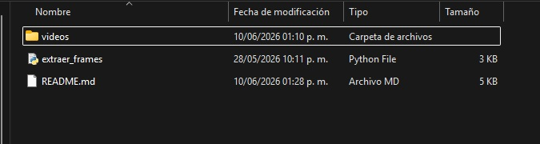
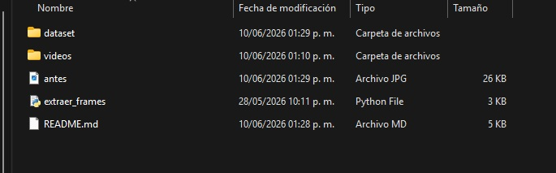

## 🇪🇸 Versión en Español

# 🎥 Extracción de Frames desde Videos para Dataset (Guía para Principiantes)

 

Este proyecto te ayuda a convertir videos en imágenes (frames), algo fundamental si estás empezando en **visión por computadora** o desarrollando tu **tesis**.

---

## 🧠 ¿Qué problema resuelve?

Cuando trabajas con modelos como YOLO o cualquier sistema de IA visual, necesitas **muchas imágenes**.

Pero normalmente tú tienes:
👉 Videos

Y lo que necesitas es:
👉 Imágenes etiquetables

Este script hace exactamente eso:
✔ Convierte videos en imágenes automáticamente
✔ Organiza los datos para entrenamiento
✔ Te ahorra horas de trabajo manual

---

## 🖼️ ¿Qué hace el script?

* Toma todos los videos dentro de una carpeta
* Extrae un frame cada cierto tiempo (ej. cada 5 segundos)
* Divide automáticamente los datos en:

  * 🧠 `train` (entrenamiento)
  * 🧪 `val` (validación)
* Guarda las imágenes con nombres organizados

---

## 📂 Estructura del Proyecto (ANTES de ejecutar)

```id="s8d1k2"
project/
│
├── videos/                # 📥 Aquí colocas tus videos
│
├── script.py              # 🐍 Script principal
└── README.md
```


---

## 📂 Estructura del Proyecto (DESPUÉS de ejecutar)

```id="f4k29s"
project/
│
├── videos/
│
├── dataset/
│   └── images/
│       ├── train/         # 🧠 Imágenes para entrenamiento
│       └── val/           # 🧪 Imágenes para validación
```



---

## ⚙️ Requisitos

Necesitas tener instalado:

* Python 3.8+
* OpenCV
* (Opcional pero recomendado) FFmpeg

---

## 📦 Instalación

### 1. Clonar el repositorio

```bash id="cl0n3r"
git clone https://github.com/TuxidoMask/video-frame-dataset-generator
cd tu-repo
```

---

### 2. Instalar dependencias

```bash id="p1p1ns"
pip install -r requirements.txt
```

---

### 3. Instalar FFmpeg (recomendado)

FFmpeg mejora el manejo de videos (aunque OpenCV ya funciona solo).

* Windows: descargar desde https://ffmpeg.org/
* Linux:

```bash id="ffm1"
sudo apt install ffmpeg
```

* Verificar instalación:

```bash id="ffm2"
ffmpeg -version
```

---

## ▶️ Cómo usarlo (Paso a paso)

### 1. Coloca tus videos

Pon tus archivos aquí:

```id="p4th"
videos/
```

Ejemplo:

```id="ej1"
videos/
├── video1.mp4
├── video2.avi
```

---

### 2. Ejecuta el script

```bash id="runn"
python script.py
```

---

### 3. Revisa el resultado

Las imágenes aparecerán en:

```id="outp"
dataset/images/train
```


```
dataset/images/val
```


---

## ⚙️ Configuración básica

Dentro del script puedes modificar:

### ⏱️ Intervalo de extracción

```python id="cfg1"
interval_seconds = 5
```

👉 Cada cuántos segundos se guarda una imagen

---

### 📊 División train/val

```python id="cfg2"
if random.random() < 0.8:
```

👉 80% entrenamiento / 20% validación

---

## 📊 Ejemplo de nombres de archivos

```id="names"
video1_f0001_t10s.jpg
```

Significado:

* `video1` → nombre del video
* `f0001` → número de frame
* `t10s` → segundo del video

---

## 🧠 ¿Cómo usar esto en una tesis?

Este proyecto es ideal para:

* Detección de eventos en video
* Entrenamiento de modelos de IA (YOLO, CNN, etc.)
* Construcción de datasets personalizados

Flujo típico:

1. 🎥 Videos
2. 🖼️ Frames (este script)
3. 🏷️ Etiquetado (LabelImg, CVAT, etc.)
4. 🤖 Entrenamiento del modelo

---

## ⚠️ Problemas comunes

❌ "No se detectan videos"
✔ Asegúrate de que estén dentro de `/videos`

❌ "FPS inválido"
✔ El video puede estar corrupto

❌ No se generan imágenes
✔ Verifica permisos de escritura

---

## 🚀 Mejoras futuras

* [ ] Interfaz gráfica (GUI)
* [ ] Exportar etiquetas automáticamente
* [ ] Integración directa con YOLO
* [ ] Configuración con `.json`

---

## 📁 Archivos importantes del repositorio

```id="impf"
videos/          # (NO subir a GitHub)
dataset/         # (NO subir a GitHub)
script.py
requirements.txt
README.md
.gitignore
```

---

## 🚫 .gitignore recomendado

```id="gitig"
dataset/
videos/
__pycache__/
*.pyc
venv/
.env
```

---

## 👨‍💻 Autor

Proyecto desarrollado como parte de una tesis en visión por computadora.

---

## 📄 Licencia

MIT License


## 🇺🇸 🇬🇧 English version

# 🎥 Video Frame Extraction for Dataset Generation (Beginner-Friendly Guide)

 

This project helps you convert videos into images (frames), which is essential if you're starting in **computer vision** or working on your **thesis**.

---

## 🧠 What problem does it solve?

When working with models like YOLO or any computer vision system, you need **a large number of images**.

But usually, you have:
👉 Videos

And what you actually need:
👉 Labeled images

This script solves that problem by:

✔ Automatically converting videos into images
✔ Organizing data for training
✔ Saving you hours of manual work

---

## 🖼️ What does this script do?

* Reads all videos inside a folder
* Extracts frames at a fixed interval (e.g., every 5 seconds)
* Automatically splits the dataset into:

  * 🧠 `train` (training)
  * 🧪 `val` (validation)
* Saves images with structured filenames

---

## 📂 Project Structure (BEFORE running)

```
project/
│
├── videos/                # 📥 Place your videos here
│
├── script.py              # 🐍 Main script
└── README.md
```


---

## 📂 Project Structure (AFTER running)

```
project/
│
├── videos/
│
├── dataset/
│   └── images/
│       ├── train/         # 🧠 Training images
│       └── val/           # 🧪 Validation images
```


---

## ⚙️ Requirements

You need:

* Python 3.8+
* OpenCV
* (Optional but recommended) FFmpeg

---

## 📦 Installation

### 1. Clone the repository

```bash
git clone https://github.com/TuxidoMask/video-frame-dataset-generator
cd you-repo
```

---

### 2. Install dependencies

```bash
pip install -r requirements.txt
```

---

### 3. Install FFmpeg (recommended)

FFmpeg improves video handling (although OpenCV works on its own).

* Windows: download from https://ffmpeg.org/
* Linux:

```bash
sudo apt install ffmpeg
```

* Verify installation:

```bash
ffmpeg -version
```

---

## ▶️ How to use (Step by step)

### 1. Add your videos

Place your files inside:

```
videos/
```

Example:

```
videos/
├── video1.mp4
├── video2.avi
```

---

### 2. Run the script

```bash
python script.py
```

---

### 3. Check the output

Images will be generated in:

```
dataset/images/train
```


```
dataset/images/val
```


---

## ⚙️ Basic configuration

You can modify these parameters in the script:

### ⏱️ Extraction interval

```python
interval_seconds = 5
```

👉 Defines how often a frame is saved

---

### 📊 Train/Validation split

```python
if random.random() < 0.8:
```

👉 80% training / 20% validation

---

## 📊 Example filenames

```
video1_f0001_t10s.jpg
```

Meaning:

* `video1` → video name
* `f0001` → frame number
* `t10s` → timestamp in seconds

---

## 🧠 How to use this in a thesis?

This project is useful for:

* Event detection in videos
* Training AI models (YOLO, CNN, etc.)
* Building custom datasets

Typical workflow:

1. 🎥 Videos
2. 🖼️ Frames (this script)
3. 🏷️ Annotation (LabelImg, CVAT, etc.)
4. 🤖 Model training

---

## ⚠️ Common issues

❌ "Videos not detected"
✔ Make sure they are inside `/videos`

❌ "Invalid FPS"
✔ The video may be corrupted

❌ No images generated
✔ Check write permissions

---

## 🚀 Future improvements

* [ ] GUI (Graphical User Interface)
* [ ] Automatic annotation export
* [ ] Direct YOLO integration
* [ ] `.json` configuration support

---

## 📁 Important repository files

```
videos/          # (DO NOT upload to GitHub)
dataset/         # (DO NOT upload to GitHub)
script.py
requirements.txt
README.md
.gitignore
```

---

## 🚫 Recommended .gitignore

```
dataset/
videos/
__pycache__/
*.pyc
venv/
.env
```

---

## 👨‍💻 Author

Project developed as part of a computer vision thesis.

---

## 📄 License

MIT License
