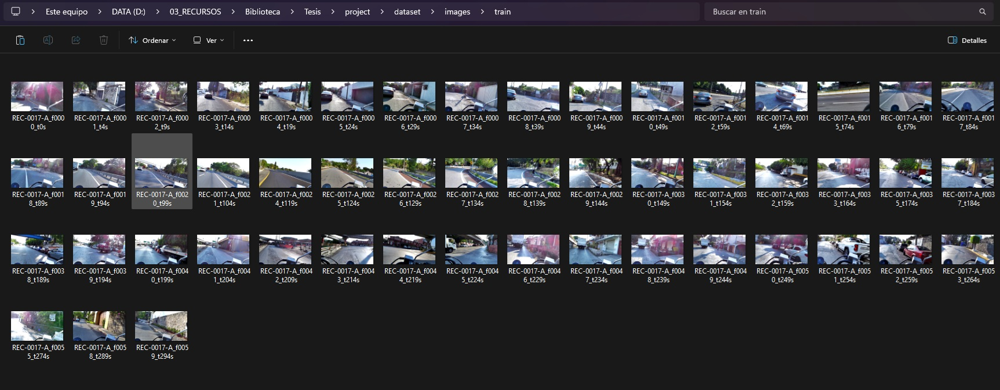
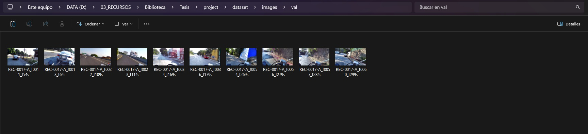

# 🎥 Extracción de Frames desde Videos para Dataset (Guía para Principiantes)

Este proyecto te ayuda a convertir videos en imágenes (frames), algo fundamental si estás empezando en **visión por computadora** o desarrollando tu **tesis**.

---

## 🧠 ¿Qué problema resuelve?

Cuando trabajas con modelos como YOLO o cualquier sistema de IA visual, necesitas **muchas imágenes**.

Pero normalmente tú tienes:
👉 Videos

Y lo que necesitas es:
👉 Imágenes etiquetables

Este script hace exactamente eso:
✔ Convierte videos en imágenes automáticamente
✔ Organiza los datos para entrenamiento
✔ Te ahorra horas de trabajo manual

---

## 🖼️ ¿Qué hace el script?

* Toma todos los videos dentro de una carpeta
* Extrae un frame cada cierto tiempo (ej. cada 5 segundos)
* Divide automáticamente los datos en:

  * 🧠 `train` (entrenamiento)
  * 🧪 `val` (validación)
* Guarda las imágenes con nombres organizados

---

## 📂 Estructura del Proyecto (ANTES de ejecutar)

```id="s8d1k2"
project/
│
├── videos/                # 📥 Aquí colocas tus videos
│
├── script.py              # 🐍 Script principal
└── README.md
```

### Imagen 1


---

## 📂 Estructura del Proyecto (DESPUÉS de ejecutar)

```id="f4k29s"
project/
│
├── videos/
│
├── dataset/
│   └── images/
│       ├── train/         # 🧠 Imágenes para entrenamiento
│       └── val/           # 🧪 Imágenes para validación
```


---

## ⚙️ Requisitos

Necesitas tener instalado:

* Python 3.8+
* OpenCV
* (Opcional pero recomendado) FFmpeg

---

## 📦 Instalación

### 1. Clonar el repositorio

```bash id="cl0n3r"
git clone https://github.com/tu-usuario/tu-repo.git
cd tu-repo
```

---

### 2. Instalar dependencias

```bash id="p1p1ns"
pip install -r requirements.txt
```

---

### 3. Instalar FFmpeg (recomendado)

FFmpeg mejora el manejo de videos (aunque OpenCV ya funciona solo).

* Windows: descargar desde https://ffmpeg.org/
* Linux:

```bash id="ffm1"
sudo apt install ffmpeg
```

* Verificar instalación:

```bash id="ffm2"
ffmpeg -version
```

---

## ▶️ Cómo usarlo (Paso a paso)

### 1. Coloca tus videos

Pon tus archivos aquí:

```id="p4th"
videos/
```

Ejemplo:

```id="ej1"
videos/
├── video1.mp4
├── video2.avi
```

---

### 2. Ejecuta el script

```bash id="runn"
python script.py
```

---

### 3. Revisa el resultado

Las imágenes aparecerán en:

```id="outp"
dataset/images/train
```


```
dataset/images/val
```



---

## ⚙️ Configuración básica

Dentro del script puedes modificar:

### ⏱️ Intervalo de extracción

```python id="cfg1"
interval_seconds = 5
```

👉 Cada cuántos segundos se guarda una imagen

---

### 📊 División train/val

```python id="cfg2"
if random.random() < 0.8:
```

👉 80% entrenamiento / 20% validación

---

## 📊 Ejemplo de nombres de archivos

```id="names"
video1_f0001_t10s.jpg
```

Significado:

* `video1` → nombre del video
* `f0001` → número de frame
* `t10s` → segundo del video

---

## 🧠 ¿Cómo usar esto en una tesis?

Este proyecto es ideal para:

* Detección de eventos en video
* Entrenamiento de modelos de IA (YOLO, CNN, etc.)
* Construcción de datasets personalizados

Flujo típico:

1. 🎥 Videos
2. 🖼️ Frames (este script)
3. 🏷️ Etiquetado (LabelImg, CVAT, etc.)
4. 🤖 Entrenamiento del modelo

---

## ⚠️ Problemas comunes

❌ "No se detectan videos"
✔ Asegúrate de que estén dentro de `/videos`

❌ "FPS inválido"
✔ El video puede estar corrupto

❌ No se generan imágenes
✔ Verifica permisos de escritura

---

## 🚀 Mejoras futuras

* [ ] Interfaz gráfica (GUI)
* [ ] Exportar etiquetas automáticamente
* [ ] Integración directa con YOLO
* [ ] Configuración con `.json`

---

## 📁 Archivos importantes del repositorio

```id="impf"
videos/          # (NO subir a GitHub)
dataset/         # (NO subir a GitHub)
script.py
requirements.txt
README.md
.gitignore
```

---

## 🚫 .gitignore recomendado

```id="gitig"
dataset/
videos/
__pycache__/
*.pyc
venv/
.env
```

---

## 👨‍💻 Autor

Proyecto desarrollado como parte de una tesis en visión por computadora.

---

## 📄 Licencia

MIT License
